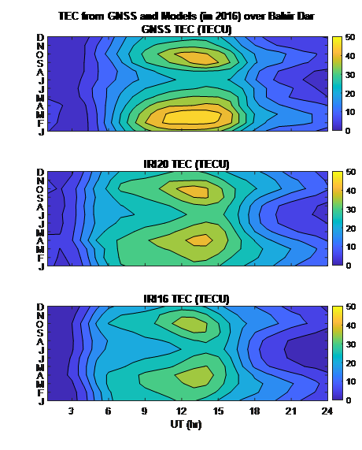

# Data Scientist

## Education

- Ph.D. in Space physics, Bahir Dar University, Ethiopia (February 2021)
- M.Sc. in Space physics, Bahir Dar University, Ethiopia (June 2011)
- B.Sc. in Physics, Bahir Dar University, Ethiopia (June 2009)

## Softwares and Skills
- Matlab, Python, SQL/MySQL
- Data Science (Data structuring, Data cleaning, Data analysis)

## Work Experiance
- Postdoctoral Researcher, Czech Academy of Sciences, Czech Republic, April 2023 – present.
- Assistant Professor of Space physics, Debre Tabor University, Ethiopia, January 2021 – March 2023.
- Lecturer at Debre Tabor University, Debre Tabor, Ethiopia, July 2011 – December, 2016.

## Projects
- Upper atmosphere dynamics
- Coupling between Ionosphere and atmosphere
- Ionospheric irregularities
- Satellite data processing and analysis

## Main outcomes
### Modeling Plasma drift velocity
[Publication](https://agupubs.onlinelibrary.wiley.com/doi/epdf/10.1029/2019RS006800)

To understand the dynamics of the equatorial ionosphere and mitigate its effect on radio wave propagation, vertical ion drift velocity empirical models have been developed using limited ground‐based and/or space‐based observations. These models, however, have not yet been validated in detail using recent observations for sufficiently different longitudinal sectors. In this paper we have evaluated the performance of two empirical models and also propose a simplified vertical drift velocity model based on basic physics laws (i.e., Ampere's and Ohm's laws) that we call it parameterized drift velocity (PDV) model. These models have been applied to estimate the Eregion electric field and the associated F region E×B drift velocity using observed horizontal magnetic fields, due to equatorial electrojet current, as model driver input. Drift velocities obtained from these models are compared with the Communication/Navigation Outage Forecasting System (C/NOFS) satellite in situ vertical drift observations for different longitudinal sectors.

 

### Valdation of International Reference Ionosphere Model (IRI-2020 TEC)
[Publication](https://www.sciencedirect.com/science/article/pii/S0273117723007913)

We evaluated and reported the International Reference Ionosphere (IRI) model's vertical Total Electron Content (TEC) regional profile. Diurnal, monthly, seasonal, and storm-time characteristics of IRI estimates over the equatorial region's ionosphere are validated. We compared the vertical TEC derived from IRI-2020 and its predecessor, IRI-2016, with the GPS-TEC measurements.
 

<a href="https://github.com/Habtamu-Alemu/Portfolio/Resume_2023.pdf" target="_blank">Full Resume</a>
